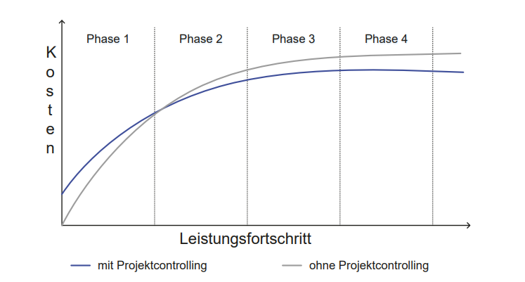
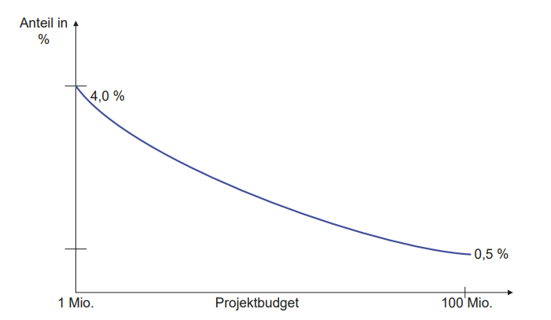
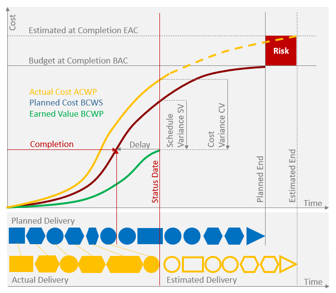
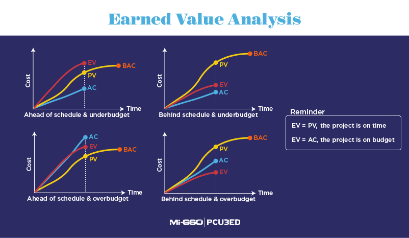
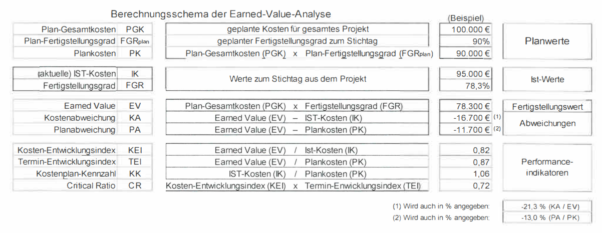

:::note
Projektcontrolling ist ein in der Literatur nicht klar definierter Begriff, jedoch lässt sich folgendes dazu sagen.
:::

Projektcontrolling ist ein funktionsübergreifendes Steuerungsinstrument, das den unternehmerischen Entscheidungs- und Steuerungsprozess in Bezug auf Projekte durch zielgerichtete Informationserarbeitung und -verarbeitung unterstützt. Dieses Controlling-Konzept zielt darauf ab, relevante Informationen über Projekte zu sammeln, zu verarbeiten und an die Entscheidungsträger im Unternehmen zu kommunizieren, um die Effizienz und den Erfolg von Projekten sicherzustellen.

Die Kernbereiche des Controllings sind die Qualitätssicherung, die Dokumentation und das Reporting. Es kümmert sich um die Planung, Steuerung, Analyse und Kontrolle bei Projekten und hilft somit bei ergebnisorientierten Entscheidungen (operative und strategische Ziele). Das Controlling liegt nahe der Führung.

### Vorteile

-   **Kosteneffizienz**: Projektcontrolling hilft, die Kosten im Blick zu behalten und sicherzustellen, dass Projekte im Rahmen des Budgets bleiben.
-   **Zeitmanagement**: Es ermöglicht die Einhaltung von Zeitplänen und Fristen, was die rechtzeitige Fertigstellung von Projekten gewährleistet.
-   **Qualitätskontrolle**: Durch Überwachung und Messung der Leistung können Qualitätsstandards eingehalten werden.
-   **Risikomanagement**: Projektcontrolling hilft dabei, Risiken frühzeitig zu identifizieren und Maßnahmen zur Risikominimierung zu ergreifen.
-   **Kommunikation** und **Transparenz:** Es fördert die offene Kommunikation innerhalb des Teams und mit den Stakeholdern, um alle auf dem gleichen Stand zu halten.

### Nachteile

-   **Kosten** und **Zeit**: Die Implementierung von Projektcontrolling erfordert Ressourcen und Zeit, die in kleineren Unternehmen möglicherweise begrenzt sind.
-   **Bürokratie**: Ein übermäßiger Kontrollaufwand kann zu einer übermäßigen Bürokratisierung führen und die Flexibilität im Projektmanagement einschränken.
-   **Mitarbeiterwiderstand**: Einige Mitarbeiter könnten Projektcontrolling als übermäßige Überwachung empfinden und dagegen Widerstand leisten.
-   **Komplexität**: Projektcontrolling erfordert die Implementierung von Tools, Prozessen und Schulungen, was zusätzliche Komplexität bedeuten kann.
-   **Fehlerquellen**: Wenn das Projektcontrolling nicht korrekt umgesetzt wird, können Fehlinformationen und Missverständnisse auftreten.

## Notwendigkeit

Laut einer Studie in Deutschland liegt der Prozentsatz der technisch gelungenen Projekten nur bei 57%. Einen wirtschaftlichen Vorteil erzielen allerdings nur 12% von allen Projekten. Nun fragen Sie sich vielleicht, warum scheitern eigentlich so viele Projekte. Hier sind einige Gründe:

-   mangelnde Kommunikation (70%)
-   schlechte Planung (56%)
-   mangelnde Ressourcen (53%)
-   optimistische Annahmen (52%)
-   unklare Rollenverteilung (51%)
-   Termindruck (28%)
-   überforderte AuftraggeberInnen (27%)
-   starre Organisation, Hierarchie (25%)
-   keine gute Projektmanagement Methodik (23%)
-   überforderte ProjektleiterIn (21%)
-   mangelndes Controlling (19%)
-   schlechte IT Infrastruktur (12%)
-   komplexes Thema (10%)
-   Sonstiges (6%)

Ein weiterer Grund, warum Projektcontrolling bei großen Projekten empfohlen wird ist die Tatsache, dass der zusätzliche Aufwand, die zusätzliche Kontrolle langfristig Geld einspart, wie in dieser Grafik gesehen werden kann:

Außerdem sinkt der Kostenanteil des Projektcontrollings indirekt proportional zur Budgetgröße des Projektes:

## Vier Aspekte

Projektcontrolling behandelt diese vier Aspekte:

-   **Planung**: Vorbereitung von benötigten Ressourcen für die Erfüllung von Zielen
-   **Kontrolle**: Überwachen und Vergleichen des IST-Standes eines Projekts mit dem in der Planung festgelegten SOLL-Stand
-   **Analyse**: Herausfinden der Konsequenzen bei Abweichungen vom SOLL-Stand
-   **Steuerung**: Umsetzung anpassender Maßnahmen, damit das Projekt nicht scheitert

Außerdem sorgt das Controlling dafür, dass Projektleiter und Mitarbeiter leichter auf Informationen zugreifen können, da diese aufgearbeitet werden.

Es gibt hierbei viele [Methoden](#instrumente--methoden), welche den Controllern in allen vier Aspekten als Hilfe zur Verfügung stehen.

## ProjektcontrollerIn Rolle

Da die Hauptaufgaben des Controllings Qualitätssicherung, Dokumentation und Reporting sind, müssen die ControllerInnen hauptsächlich analytische Aufgaben tätigen. Darunter fallen diese Tätigkeiten:

-   die Buchhaltung für das Management brauchbar / nutzbar aufbereiten
-   Sicherung des Erreichens der Ziele mithilfe
    -   Soll-Ist-Vergleich
    -   Abweichungen feststellen
    -   Konsequenzen bewerten
    -   Maßnahmen vorschlagen
    -   Durchführung kontrollieren

> Der Controller ist die finanzielle Führungskraft eines großen oder mittelgroßen Unternehmens der die Verantwortlichkeiten kombiniert. _- Goodman_

## Instrumente / Methoden

Mit der Zeit haben sich viele Hilfsmittel entwickelt, welche im Bereich Projektcontrolling Unterstützung bei den [vier Aspekten](#vier-aspekte) bieten.

#### Kosten- und Leistungskontrolle

-   Soll-Ist-Vergleich
-   ABC-Analyse
-   Earned-Value-Analyse
-   Meilenstein-Trend-Analyse
-   Finanzplan

#### Berichtswesen

-   Kennzahlenanalyse
-   Nutzung geeigneter Software

#### Erfahrung

-   Interviews
-   Datenbanken mit Knowhow

### ABC Analyse

> _Durch welche Kunden erzielt unser Unternehmen den größten Umsatz?_

Ein bekannter Leitsatz lautet: "20% der Kunden machen 80% des Umsatzes aus" (Pareto-Prinzip). Es ist wichtig für das Unternehmen zu wissen, welche Kunden eine hohe Priorität in Bereichen Kundensupport, Dienstleistungen usw. bekommen. Bei Kundenunzufriedenheiten ist es wichtig, dass das Unternehmen Anfragen von den A-Kunden (die wichtigsten Kunden, welche ca. 80% des Umsatzes ausmachen) schneller löst als zum Beispiel von C-Kunden, weil sonst der A-Kunde eventuell nicht mehr Kunde ist und dem Unternehmen enorme Umsatzverluste einspielt.

### Terminkontrolle

Die regelmäßige und rechtzeitige Rückmeldung der „Ist-Termine" an den Projektleiter ist die Voraussetzung für eine wirkungsvolle Terminkontrolle. Zu jedem Arbeitspaket (Soll-Termin) ist anzugeben, ob der Termin eingehalten, überschritten oder vorverlegt wird.

#### Gründe

-   Änderung des Leistungsumfangs oder der Qualitätsanforderungen
-   unvorhersehbare Probleme
-   unrealistische Schätzung des Aufwands
-   Personalengpässe durch Krankheit oder Ausscheiden von Teammitgliedern
-   geringe Produktivität durch schlechte Koordination, mangelnder Erfahrung oder geringer Sachkenntnis

#### Maßnahmen

-   Mobilisierung zusätzlicher Personalressourcen
-   Erhöhung der Arbeitszeit / Produktivität
-   Outsourcing / Outtasking

#### Termintreue

Als Kennzahl zur Beschreibung der Termintreue in einem Projekt können geplante Dauer und Verzug dargestellt werden.

---

### Kostenkontrolle

Eine zeitliche Kostenkontrolle hat nicht nur den Vorteil während des Projekts Kosten vermeiden zu können, sondern hilft auch zukünftigen Projekten das bessere Planen von Kosten, weil man aus der Erfahrung profitiert.

Man kann die Kosten pro Monat auflisten (Bild links), um einen schnellen Überblick über die kostenintensiven und sparsamen Monate (oder allgemein Zeiteinheiten) zu bekommen, oder man kumuliert die Kosten (Bild rechts), um einen übersichtlichen Vergleich zwischen SOLL- und IST-Kosten zu erhalten.

### Sachfortschrittskontrolle

Bei der Sachfortschrittskontrolle (auch Leistungskontrolle) geht es um die Bestimmung des erledigten Anteils eines Arbeitspaketes. Hierfür gibt es einige Vorangehensweisen:

-   **Statusschritt-Technik**
-   **50-50-Technik**: 50% erledigt, sobald das Arbeitspaket gestartet; 100%, wenn fertig
-   **0-100-Technik**: 0%, solange nicht fertig; 100%, wenn fertig; macht nur Sinn bei kleinen Arbeitspaketen
-   **Mengen-Proportionalität**: Anwendbar, wenn mess- oder zählbare Ergebniseinheiten vorliegen. Eine abgearbeitet Einheit (z.B. assemblierter PC) repräsentiert einen bestimmten Zuwachs von Fortschrittsgrad bzw. Fertigstellungswert (Earned Value, s.u.).
-   **Zeit-Proportionalität**: Für bestimmte Projekttätigkeiten, wie z.B. das Projektmanagement, für die eine „gleichmäßige Verteilung" über den gesamten Projektverlauf angenommen wird. Der Fortschrittsgrad ergibt sich aus der abgelaufenen Zeitdauer.

### Earned-Value Analyse

Der Earned-Value ist eine Kennzahl, welche bei der Bestimmung folgender Fragen hilfreich ist:

> _Liegt mein Projekt zum Kontrollzeitpunkt im **Kostenplan** oder nicht?_

-   Ja, wenn der Earned-Value höher ist als die Ist-Kosten. Das bedeutet, dass Sie innerhalb des Budgets liegen oder sogar darunter.
-   Nein, wenn der Earned-Value niedriger ist als die Ist-Kosten. In diesem Fall überschreiten Sie das Budget und Ihr Projekt liegt kostenmäßig "hinten".

> _Liegt mein Projekt zum Kontrollzeitpunkt im **Zeitplan** oder nicht?_

-   Ja, wenn der Earned-Value höher ist als die Plankosten. Das bedeutet, dass Sie mehr Fortschritt erzielt haben, als ursprünglich geplant, und Ihr Projekt liegt zeitlich "vorne".
-   Nein, wenn der Earned-Value niedriger ist als die Plankosten. In diesem Fall haben Sie weniger Fortschritt erzielt als geplant, und Ihr Projekt liegt zeitlich "hinten".

Dabei sieht ein Diagramm bei der Earned-Value-Analyse so aus:

Beim `Status Date` findet die aktuelle Messung des Fertigstellungsgrades (Wie viele Arbeitspakete hat man prozentuell schon geschafft?) und der IST-Kosten statt. Daraus errechnet sich ein `Earned Value`, welcher durch die rote Linie dargestellt ist.

Nun kann man den `Earned Value` mit den `Planned Cost` bzw. `Planned Value` vergleichen, um herauszufinden, ob die Arbeitspakete zeitlich laut Plan verlaufen. Außerdem kann man den `Earned Value` mit den `Actual Cost` vergleichen, um herauszufinden, ob man mehr oder weniger Kosten als im Plan bereits verbraucht hat.

In diesem Bild sind alle vier möglichen Szenarien übersichtlich dargestellt:

Mithilfe der Earned-Value-Analyse kann man sich viele weitere Kennzahlen berechnen, die dem Controller Auskunft über den Projektstatus geben.

## Controlling Prozess

Die meisten Projekte beginnen damit, dass ein Kunde in einem Meeting die Idee des Produktes erklärt und nun von dem Unternehmen haben möchte, dass diese Anforderungen schnell, billig und qualitativ umgesetzt werden. Das Unternehmen beginnt zu planen, indem zuerst die Ziele definiert werden. Das Projektcontrolling kann die planenden Mitarbeiter mit reichlichen Informationen ausstatten, welche nützlich sein könnten. Nach einem häufigen Austausch zwischen Lasten- und Pflichtenheft kann das Projekt dann offiziell gestartet werden.

Ab der Durchführung wird die Aufgabe des Controllings noch wichtiger. Es muss nun regelmäßig einen Statusprobe entnehmen, welche auf Abweichungen untersucht wird (zum Beispiel mittels Soll-Ist-Vergleich). Falls Abweichungen auftreten, muss das Controlling Maßnahmen definieren, welche direkt in die Durchführung einfließen werden. Außerdem müssen wahrscheinlich einige Termine in der Planung verändert und dem Kunden mitgeteilt werden. Dieser Prozess wiederholt sich bis zur Fertigstellung des Produktes.

## Mögliche Quellen für Abweichungen

### Planungsfehler

-   fehlende Erfahrung
-   Teile des Projekts werden vergessen
-   falsche Schätzung für den Ressourcenaufwand
-   Komplexität überfordert Mitarbeiter
-   Zeit- und Kostendruck

### Unvorhersehbare Ereignisse

-   neue Anforderungen während der Durchführung
-   technische Probleme
-   Ausscheidung von Mitarbeitern
-   Konkurs von Lieferanten

### Ausführungsfehler

-   mangelnde Mitarbeiterqualifikationen
