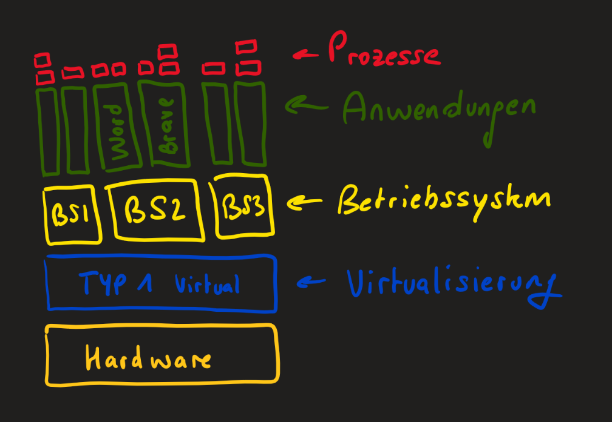

Die Virtualisierung ermöglicht die Erstellung von virtuellen Instanzen von Hardware- und Softwarekomponenten. Das Hauptziel besteht darin, physische Ressourcen zu abstrahieren, um flexiblere und effizientere IT-Infrastrukturen zu schaffen. Durch die Schaffung isolierter virtueller Umgebungen können vorhandene Ressourcen besser genutzt und die Skalierbarkeit verbessert werden. Virtualisierung bildet nicht nur die Grundlage für Cloud Computing, sondern findet auch in Rechenzentren, Netzwerken und Endgeräten vielfältige Anwendungen.

## Vorteile

-   das Testen von neuen Betriebssytemen
-   das Testen von neuen Applikationen auf Betriebssystemen
-   Schulung von Umgebungen, welche einfach wieder gelöscht werden können
-   Hardware-Ressourcen besser ausnutzen
-   Snapshots erstellen und wiederherstellen
-   Cloud Hosting Server mieten

## Geschichte

Das Konzept der Virtualisierung wurde das erste Mal innerhalb der 1960er Jahre genutzt, um die Mehrbenutzerfähigkeit umzusetzen. Damals hatten Betriebssysteme noch nicht die Funktionalität von mehreren Benutzern integriert, weshalb der einfachste Weg, dies zu erreichen, weitere Instanzen des Betriebssystems waren. Aufgrund der Weiterentwicklungen - Betriebssysteme waren später sowieso automatisch die mehrbenutzerfähig - wurde das Konzept nicht weiterverwendet.

Um das Jahr 2010 herum wurde das Konzept der Virtualisierung wieder verwendet, weil Entwickler nun Anwendungen und Betriebssysteme testen können wollten. Außerdem kann man Hardware-Ressourcen viel besser ausnutzen, da in einem Unternehmen gewisse Dienste nur zu gewissen Zeiten exzessiv verwendet werden. Beispielsweise melden sich zwischen acht und neun Uhr viele Mitarbeiter am Domain Controller an, am Nachmittag werden sehr viele E-Mails verschickt und Dateien ausgedruckt. Um kostspielige Ressourcen besser nutzen zu können, kann man Server, welche genau diese Aufgaben erfüllen, virtualisierung, damit zu bestimmten Zeiten verschiedene Server flexibel Ressourcen zur Verfügung gestellt bekommen. Virtualisierung hilft dementsprechend enorm bei flexibler Skalierung.

## Begriffe

Bei einem virtualisierten System gibt es immer zwei wesentliche Teilnehmer:

-   **Host**  
    Der Host ist der Computer, auf welchem die virtuellen Betriebssyteme laufen. Auf diesem Host läuft ein [Hypervisor](#hypervisor), welcher die verschiedenen virtuellen Maschinen bzw. Guests verwaltet.

-   **Guest**  
    Das virtuelle Betriebssysteme wird vom [Hypervisor](#hypervisor) verwaltet und läuft somit auf dem Host.

## Hypervisor

Der Hypervisor ist ein `Virtual Machine Monitor`, welcher die Instanzen der virtuellen Betriebssysteme steuert und verwaltet. Dieses Progamm hat die Aufgabe, den virtuellen Maschinene `Rechner-Ressourcen` möglichst effizient zuzuweisen. Denn genau wie jeder andere Computer, benötigen auch virtuelle Maschinen CPU-Ressourcen, Arbeitsspeicher, Festplattenspeicher, Netzwerkkarten und vieles mehr. All diese Ressourcen werden dynamisch aufgeteilt. Benötigt beispielsweise ein Domain Controller momentan viel Kapazitäten, da sich gerade viele Benutzer anmelden wollen, kann der Hypervisor dem Domain Controller fast die gesamten Ressouren zuschreiben, während andere Server währenddessen im Minimalbetrieb laufen.

Je nach Virtualisierungstyp ist der Hypervisor entweder ein einfaches `Anwendungsprogramm`, welches auf einem Betriebssystem installiert ist, oder die `Installation`, welche direkt auf der Hardware aufgesetz wird.

## Virtualisierungstypen

### Typ 1 Virtualisierung

Bei einer Typ 1 Virtualisierung (auch Bare-Metall Virtualisierung genannt) interagiert der Hypervisor direkt mit der Hardware. Es gibt kein Betriebssystem zwischen Hardware und Hypervisor. Weil ein Hypervisor ohne Betriebssystem nicht installierbar ist, muss man bei einer Installation zuerst ein Betriebssystem installieren, von welchem aus man anschließend den Hypervisor installieren kann, um anschließend die Betriebssysteme installieren zu können 🫠.

#### Beispiele

-   VMware ESXi (ehemals ESX)
-   Citrix Xen
-   Hyper-V

### Typ 2 Virtualisierung

Bei einer Typ 2 Virtualisierung läuft der Hypervisor als einfaches Anwendungsprogramm auf dem unterliegenden Betriebssystem. Dabei muss dem virtualisierten Betriebssystem vorgetäuscht werden, dass es als einziges Zugriff auf die Hardware hat.

---

Jedoch kann der Hypervisor als Anwendung dem virtuellen Betriebssystem nicht vortäuschen, dass die Hardware-Ressourcen nur ihm gehören, weil er selbst auch vom Betriebssystem verwaltet wird. Eine mögliche Lösung für dieses Problem besteht darin, dass der Hypervisor Techniken wie Hardware-Virtualisierung oder Hardware-Assisted Virtualisation verwendet. Diese Technologien ermöglichen es dem Hypervisor, direkten Zugriff auf bestimmte Hardware-Ressourcen zu erhalten, ohne dass das Host-Betriebssystem jeden Zugriff vermitteln muss. Dies verbessert die Leistung und Effizienz der Virtualisierung.

Die Hardware-Virtualisierung wird oft durch CPU-Funktionen wie Intel VT-x oder AMD-V ermöglicht. Diese Technologien erlauben es dem Hypervisor, virtuelle Maschinen direkt auf die physische Hardware zuzugreifen, wodurch die Verwaltungsschicht des Host-Betriebssystems umgangen wird. Dadurch kann der Hypervisor dem virtualisierten Betriebssystem effektiv vortäuschen, dass es exklusiven Zugriff auf die Hardware hat.

#### Beispiele

-   VMware Workstation Player
-   VirtualBox

### Paravirtualisierung

### Containervirtualisierung
